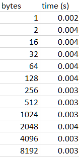
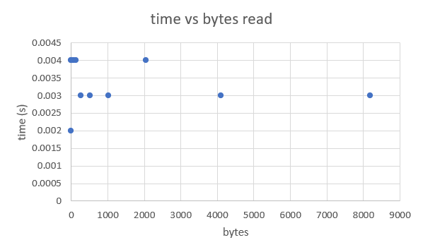
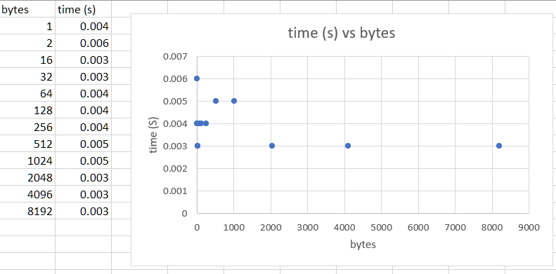

# Ji_CSC357_Lab_3

## Task 2 stuff

it can be inferred that the system doesn't take a long time to read files

## Task 3 stuff

## Task 4: Reflection
while both have different mean values in their time, the pattern remains that all operations of read or fread take around the same time no matter how many bytes, which may be because there isn't enough bytes read to truly test the limits of the operation. While it seems like fread is slower than read, it remains apparent that in both the last few data points of 4096 and 8192 bytes, they each took only 0.003s. So it is a reasonable conclusion that both functions take around the same time no matter which one is used.